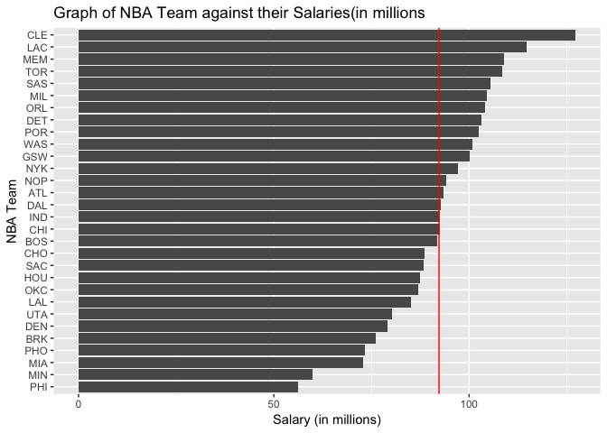
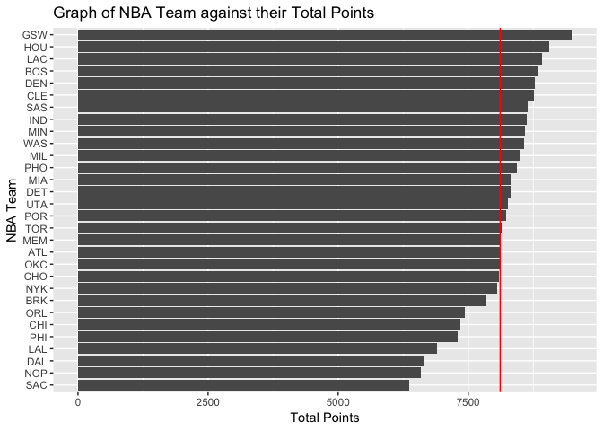
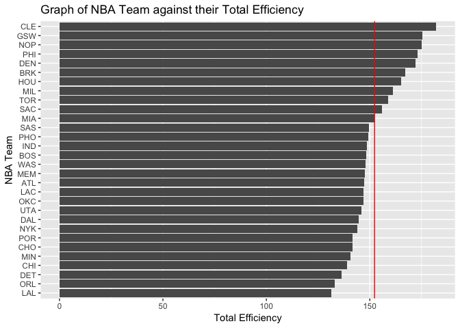
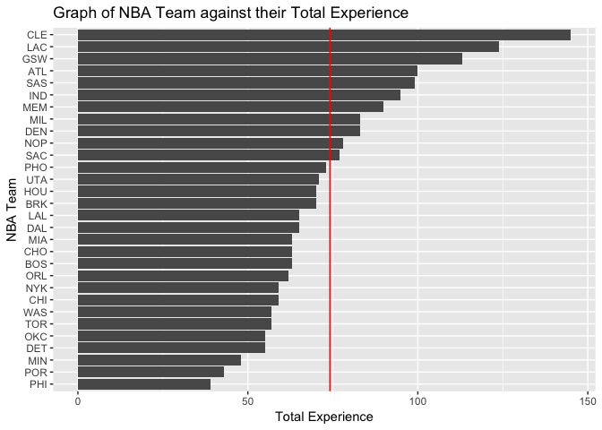

Data Wrangling and Visualization
================
Yin Chen Wan
9/27/2018

1) File Structure
=================

``` bash
cd Desktop/stat133/stat133-hws-fall18/
mkdir workout1
cd workout1/
git init
git remote add origin https://github.com/yinchen202009/workout1.git
git status
touch README.md
mkdir data
mkdir code
mkdir output
mkdir report
git status
git add README.md
git commit -m "New README.md file"
git status
```

Download the data
-----------------

``` bash
cd data
curl -O https://raw.githubusercontent.com/ucb-stat133/stat133-fall-2018/master/data/nba2018.csv
git status
git add nba2018.csv
git status
git commit -m "Downloaded nba data"
```

2) Create a README.md File
==========================

After adding description of the workout to the file and saving it:

``` bash
git status
cd ..
git add README.md 
git commit -m "Added description of the HW"
git status
```

3) Create a data dictionary
===========================

``` bash
pwd
cd data
touch nba2018-dictionary.md
git status
git add nba2018-dictionary.md
git status
git commit -m "Created data dictionary"
git status
```

Saving the dictionary after adding contents
-------------------------------------------

``` bash
git status
git add nba2018-dictionary.md
git status
git commit -m "Added description of data to dictionary"
```

4) Data Preparation
===================

Done in "make-teams-table.R"

5) Ranking of Teams
===================

``` r
teams <- read.csv("../data/nba2018-teams.csv")
#ranking of teams according to salary
library(dplyr)
```

    ## Warning: package 'dplyr' was built under R version 3.4.4

    ## 
    ## Attaching package: 'dplyr'

    ## The following objects are masked from 'package:stats':
    ## 
    ##     filter, lag

    ## The following objects are masked from 'package:base':
    ## 
    ##     intersect, setdiff, setequal, union

``` r
rank <- select(teams, team, total_salary)
rank <- arrange(rank, desc(total_salary))
```

    ## Warning: package 'bindrcpp' was built under R version 3.4.4

``` r
head(rank)
```

    ##   team total_salary
    ## 1  CLE     127.2546
    ## 2  LAC     114.7766
    ## 3  MEM     108.9458
    ## 4  TOR     108.4585
    ## 5  SAS     105.3955
    ## 6  MIL     104.6466

``` r
mean(teams$total_salary)
```

    ## [1] 92.29469

``` r
library(ggplot2)
```

    ## Warning: package 'ggplot2' was built under R version 3.4.4

``` r
ggplot(rank) +
  geom_bar(aes(x= reorder(team, total_salary), y= total_salary), stat='identity') +
    coord_flip() +
  labs(y = "Salary (in millions)", x= "NBA Team", 
       title= "Graph of NBA Team against their Salaries(in millions") +
  geom_hline(yintercept=  92.29469, linetype, color='red')
```



``` r
#teams ranked by total points
rankpoints <- select(teams, team, total_points)
rankpoints <- arrange(rankpoints, desc(total_points))
head(rankpoints)
```

    ##   team total_points
    ## 1  GSW         9491
    ## 2  HOU         9065
    ## 3  LAC         8911
    ## 4  BOS         8857
    ## 5  DEN         8783
    ## 6  CLE         8770

``` r
mean(teams$total_points)
```

    ## [1] 8114.4

``` r
library(ggplot2)
ggplot(rankpoints) +
  geom_bar(aes(x= reorder(team, total_points), y= total_points), stat='identity') +
    coord_flip() +
  labs(y = "Total Points", x= "NBA Team", 
       title= "Graph of NBA Team against their Total Points") +
  geom_hline(yintercept=  8114.4, linetype, color='red')
```



``` r
#teams ranked by Total efficiency
rankeff <- select(teams, team, total_eff)
rankeff <- arrange(rankeff, desc(total_eff))
head(rankeff)
```

    ##   team total_eff
    ## 1  CLE  182.0806
    ## 2  GSW  175.3384
    ## 3  NOP  175.1662
    ## 4  PHI  172.9546
    ## 5  DEN  172.2445
    ## 6  BRK  167.0333

``` r
mean(teams$total_eff)
```

    ## [1] 152.3035

``` r
library(ggplot2)
ggplot(rankeff) +
  geom_bar(aes(x= reorder(team, total_eff), y= total_eff), stat='identity') +
    coord_flip() +
  labs(y = "Total Efficiency", x= "NBA Team", 
       title= "Graph of NBA Team against their Total Efficiency") +
  geom_hline(yintercept=  152.3035, linetype, color='red')
```



``` r
#teams ranked by Total experience
rankexp <- select(teams, team, total_experience)
rankexp <- arrange(rankexp, desc(total_experience))
head(rankexp)
```

    ##   team total_experience
    ## 1  CLE              145
    ## 2  LAC              124
    ## 3  GSW              113
    ## 4  ATL              100
    ## 5  SAS               99
    ## 6  IND               95

``` r
mean(teams$total_experience)
```

    ## [1] 74.13333

``` r
library(ggplot2)
ggplot(rankexp) +
  geom_bar(aes(x= reorder(team, total_experience), y=total_experience), stat='identity') +
    coord_flip() +
  labs(y = "Total Experience", x= "NBA Team", 
       title= "Graph of NBA Team against their Total Experience") +
  geom_hline(yintercept=  74.13333, linetype, color='red')
```



Comments and Reflections
========================
